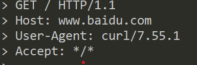

## 1.URL 包含哪几部分，每部分分别有什么作用?
> url:协议+域名/ip+端口号+路径+查询字符串+锚点  

* 域名是对ip的别称,域名也由前缀和后缀两部分组成，各部分之间用小数点分开如:baidu.com
* 端口:是设备与外界通讯交流的出口,是指接口电路中一些寄存电路,这些寄存器存放数据信息,控制信息,状态信息,相应的端口也可被称为数据端口,控制端口,状态端口.
* 路径:可在同一服务器下使用不同路径请求不同页面
* 查询字符串:同一页面不同内容
* 锚点:同一页面内容,不同位置
## 2.DNS 的作用是什么，nslookup 命令怎么用?
1. DNS (Domain Name System)
* dns的作用：将域名（网址）解析为IP地址，这个过程叫做DNS域名解析。 客户端向DNS服务器发送域名查询请求；然后DNS服务器告知客户机Web服务器的IP地址；最后客户机与Web 服务器进行通信。
2. nslookup 域名
* 可通过命令行来查出对应域名下的所有IP
## 3.IP 的作用是什么，ping 命令怎么用?
1. IP 指的是：网际互联协议。英文是Internet Protocol ，缩写就成了IP.
* ip分为内网与外网,都是通过路由器来中转.
* 内网设备可以互相访问,但不能直接访问外网,外网也是相同道理.
* 内网与外网就像2个隔绝的空间,位移联通点就是路由器,所以路由也被叫做"网关"
>例如，在我们家里常用的地址：192.168.1.2中，192.168.1为网络地址。主机地址位于IP地址的后段，用来标识具体设备。同一网络上的设备都具有唯一的IP地址，只有IP地址唯一才能正常通信。就拿刚才的电话号码来说，只有号码唯一才能真正找到人，在IP地址192.168.1.2中，2就是主机地址。
2. ping 域名
* 使用命令行找出此域名下的IP相应4次(windows)
## 4.域名是什么，分别哪几类域名?
1. 域名就是对IP的别称
* 域名是为了方便记忆，网络中每个域名会对应一个ip，而我们往往记住的是域名，比如百度的域名http://www.baidu.com，相比ip地址[163.177.151.109]（百度服务器其中一个ip）而域名是很好记住的。
* 一个域名可以对应多个ip,这种叫负载均衡,减少服务器压力
* 一个ip也可以有多个域名,称为共享主机,普通开发者的选择
2. 分别有哪些域名呢?
* 顶级域名就是一级域名，比如 .com .org .cn .net
* 二级域名如 google.com baidu.com zhihu.com mozilla.org
* 三级域名如 xxx.github.io www.qq.com
  

参考:https://zhuanlan.zhihu.com/p/27290218
# 扩展

## hosts是什么?
Hosts是一个没有扩展名的系统文件，可以用记事本等工具打开，其作用就是将一些常用的网址域名与其对应的IP地址建立一个关联“数据库”，当用户在浏览器中输入一个需要登录的网址时，系统会首先自动从Hosts文件中寻找对应的IP地址，一旦找到，系统会立即打开对应网页，如果没有找到，则系统会再将网址提交DNS域名解析服务器进行IP地址的解析。
## 端口知识补充
* http服务使用80端口
* https使用443端口
* ftp使用21端口
* 一个有65535个端口
* 0-1023号端口是留给系统使用的,只有获得管理员权限后才能使用这1024个端口
* 其他端口只能给普通用户使用
* 命令行中使用http-server默认使用8080端口
* 一个端口被占用,只能另选一个
## curl 命令发送http请求
1. curl -v http://www.baidu.com
2. curl -s -v https://www.baidu.com
* url被curl工具重写后,请求dns获得ip,TCP连接成功后,开始发送http请求
* 请求的格式如下!  

* 小于号内部的就是相应的内容